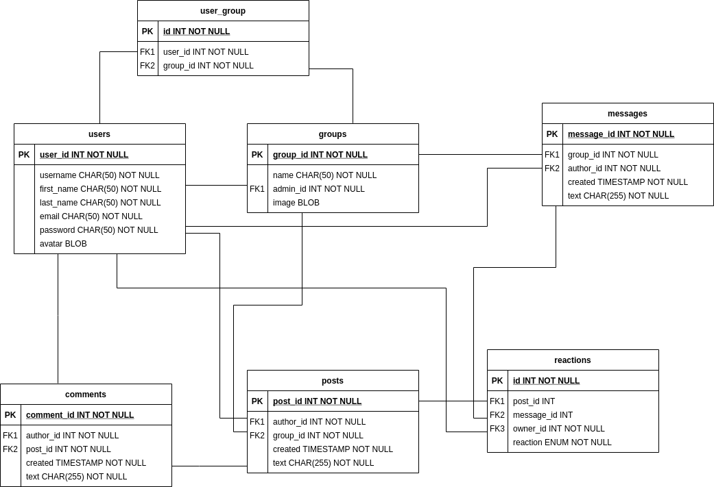

# Grupkowo
Projekt na aplikacje mobilne. Uzytkownicy mają dostęp do grup, w których mogą dodawać posty, koemntować i reagować na nie. Każdy z użytkowników może zakladać nowe grupy. Do każdej grupy przypisany jest jeden chat, na który każdy może wysyłać wiadomości.

## Funkcjonalności:
* założenie / edycja / usunięcie konta
* utworzenie / usunięcie grupy
* dodanie / usunięcie użytkowników z grupy, której jest się adminem
* dodanie / edycja / usunięcie posta w grupie
* dodanie / edycja / usunięcie komentarza pod postem
* reagowanie na posty
* wysłanie wiadomości do chatu
* reagowanie na wiadomości

## Klient
Aplikacja mobilna na system Android 11 (API 30+), napisana w języku kotlin.

## Serwer
Napisany w pythonie, z wykorzystaniem [FastAPI](https://fastapi.tiangolo.com/).
Rozpis end-pointów można znaleźć wewnątrz folderu `Server`.

## Baza Danych
Relacyjna baza danych MySQL, wykorzystując połączenie `sqlite3` o poniższym schemacie:
